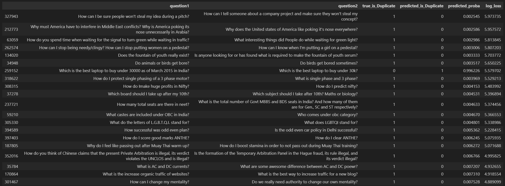

# Quora Question Pair Similarity Detection

The objective of this project is to build a predictive model that can correctly determine if two questions are duplicates, using a combination of engineered textual features and advanced language representations.

## The Problem

Online platforms like Quora often receive many questions that are semantically identical but phrased differently. Automatically detecting these duplicate questions helps reduce redundancy and improve user experience.

This problem is non-trivial because questions that have the same meaning may differ in vocabulary or syntax. The goal of this project is to determine whether two questions are duplicates using both traditional NLP techniques and modern language models.

## The Dataset

The dataset contains over 400,000 question pairs from Quora. Each row includes:

    question1, question2: The two questions to compare
    is_duplicate: Binary label indicating if they are semantically the same
    id, qid1, qid2: Identifiers

## Methodology

**EDA and Preprocessing:** 
First some exploration was conducted to determine the state of the textual data, especially with regards to data quality. After inspection, three levels of cleaning were devised, from light to more aggressive, to better suit the embedding strategies used after.

**Feature Engineering:** 
The heart of this project was to carefully and cleverly engineer features based on each pair. The main idea was to either compare and contrast the questions of the pair directly, exctracting a scalar feature, or use various embedding methods to construct a vector representation for each question in the pair and then compare them using one or more vector similarity metrics. For this step, a collection of lexical, syntactic and transformer-based features were created. 

**Modeling:**
Finding the perfect Machine Learning model for classification was not entirely aligned with the scope of this project, so XGBoost was chosen due to its general robustness with heterogeneous features and strong performance on structured data. The model was evaluated with 5-fold Cross Validation, observing negative log-loss as the main performance metric. Feature importance exploration was conducted post-training, using the model-agnostic permutation importance and the booster's own feature importance vector as well.

**Hyperparameter Tuning:**
Bayesian optimization over 50 trials was used to choose the hyperparameters that minimize log loss.

**Post-hoc Analysis:** 
Misclassification analysis was conducted to draw insights about data quality and opportunities to improve model performance. 

## Results and Key Takeaways

- Final Model Accuracy: 85.13%
- Final Log Loss: 0.3102
- MiniLM and DistilBERT embeddings were the strongest contributors to performance. Jaccard similarity emerged as a surprisingly good feature as well.
- Mean absolute (element-wise) difference and cosine similarity were the metrics found at the top of the feature importance lists.
- Some features like POS overlap and TF-IDF multiplication were found redundant and removed.
- Serious data quality issues were identified post-hoc. Manually going through the pairs that produced the largest log-loss (outliers) revealed that nearly all of them were mislabeled and the model had actually classified them correctly.

## Future Work

- Address mislabeled data points to reduce confident wrong predictions.
- Improve generalization on subtle paraphrases using data augmentation or ensemble models.
- Try other classifiers like Logistic Regression variants or even a shallow neural network.

## Repository Contents

- `EDA - Preprocessing Notebook.ipynb`: Exploratory Data Analysis (EDA) and text cleaning notebook. This notebook generates the cleaned dataset.
- `NLP Notebook.ipynb`: Main notebook. Uses the cleaned data produced by the EDA notebook.
- `requirements.txt`: List of required Python packages for running both notebooks.
- `Report.pdf`: A written report describing the project in full detail.

## Project Context

This project was developed as part of the Natural Language Processing course for the MSc in Data Science Programme at the International Hellenic University. 
